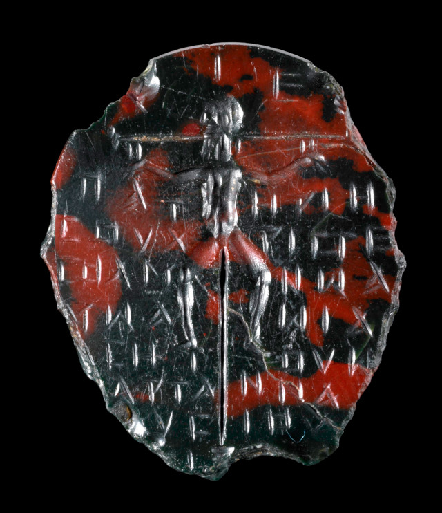

[← tillbaka](README.md)  

# Blodsten

  
_Objekt BM 1986,0501.1 © The Trustees of the British Museum CC BY-NC-SA 4.0_

\-

Sonens död  
naken på en blodsten  
ordet korsfäst  
jaspisrunor glöder

Repen runt hans armar  
och korsets timmer  
det lilla lammet bräker  
smord och övergiven  

Stig i sången!  
Sången av vokaler  
sjung! ad astra  
voces magicae  

Legein! Säg namnen!  
Ia-de-to-phōth  
Tetragramaton  
och Immanu'el

Ändra inte tecknen  
Sa-tra-per-kmēph  
repor på en blodsten  
Ordets liv