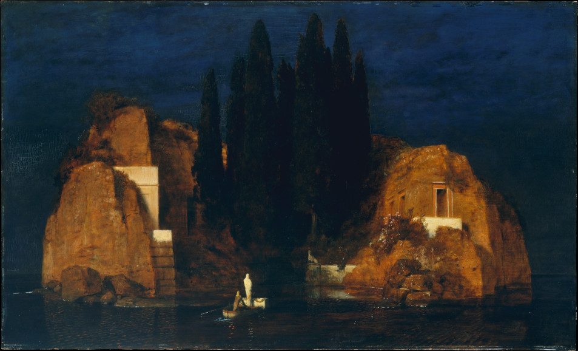

[← tillbaka](README.md)  

# Dödens ö

  
_(Inspirerad av Böcklin och Rachmaninov)_

\-

Utan brådska sänker Kharon  
sina åror genom vattenspegeln.  

Solens sista strålar värmer ryggen.  
Vi ror till dödens ö.  

På stranden blandas guld och karmosin  
med öns cypressers skuggade safir.  

Jag står i fören, svept i linne.  
Ren och smord med olibanumolja,  
njutande en utsökt epilog.  

Ingen hand har vidrört stenen, som  
rullats undan och nu blottar graven.  

Jag kallas till min dunkla katakomb,  
till sömn på doft av skuggig sommarsten.  

Att blunda, andas ut i mörkret,  
en sista gång och aldrig mer.  

Hineini Adonai!  
Adonai, Adonai ha-Aretz.  

Låt mörker komma. Kom död, kom vila.  
Låt tankar skingras och ta slut.  

Så upphör soluret att visa tiden  
och hela livet har med det mätts ut.  

\-

Allt är tystnad. Allt är mörker.  
Men allt är inte alltid som man trott.  

Någonstans i mörkret hörs en ...  
flöjt? Pianissimo adagio.  

Knappt hörbar viskas andens melodi.  
Det susar, något lossnar ifrån kroppen.  

Ett litet ljus som tänds i natten,  
sprunget från sitt spruckna kärl.  

När solen stiger nästa morgon  
är min kropp allt jämnt kvar i graven,  
men jag är inte längre där.  
