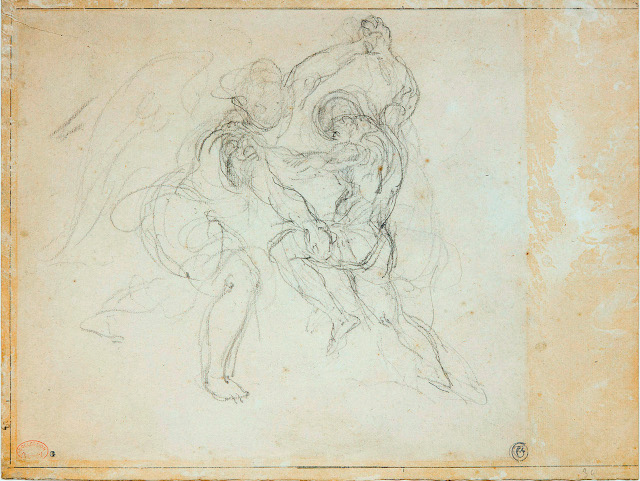

# Jakobs Höft

_(Eugene Delacroix, 1850)_

\-

En ivrig bävan vällde upp på kvällen.  
Han visste att det skulle ske i natt,  
men inte hur.  

Ensam. Framför floden.  

Jabbok, streck av blått i stenig torka,  
andas svala stråk av vattendoft.  
Gräns till före och till efter.  

Väntar. Insektsången.  

Plötslig står en främling vid hans sida  
griper runt hans hals  
Utan ord har striden börjat.  

Kämpar. __  

Benen ömsom stödjer, ömsom snubblar  
Fyra fötter sparkar damm i luften  
Vinden spinner molnet till spiraler  

Frustar. Virvelpelare som dansar.  

De tömmer ut sig själva i varnadra  
Jakob sliter i den andres kött.  
Ängeln vidrör höftens spända sena.  

Välsignad. Också skadad.  

» Släpp mig! Gryning « flämtar anden  
Tårar gräver fåror över kinden  
Haltar segrande ur nederlaget  

Jakob. Vad är ditt namn?  
