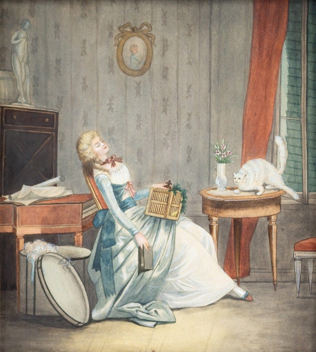

[← tillbaka](README.md)  

# Lek I - III

  

### I

Jag leker en lek  
en tråkig lek  
leken är att ha tråkigt  

Att avstå handling  
låta händer vila  
driva för mig själv

### II

Jag leker en lek  
en slösaktig lek  
leken är att slösa  

Att inte skriva ner  
strofer eller ord  
dikta till mig sjäv  

### III

Jag leker en lek  
en förljugen lek  
leken är att ljuga  

Att inte låssa om  
att jag aldrig leker  
ljuga för mig själv  
