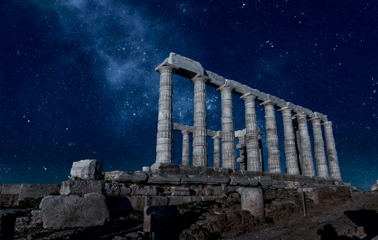

# Skymning över Sounion

  

\-

Han kom från havet sent på natten  
till Attikas södra spets  
till ett spjut av sten i Hellas vatten  
blekgul ockra genom blå topas  

Med möda uppför kapets branta klippor  
till en öde udde: Sounion  
mot det gamla templet styr han stegen  
mot en ensam, bortglömd konungs tron  

Bakom honom smeker månen  
med svala fingrar havets rygg till sömns  
Hon sjunger tyst för spruckna pelartrummor  
och bäddar ner sig själv i bergablock  

Han minns när hon ran ut i Lauron  
och skördades och las på hög  
och hur hon blev till vin och skepp och makt  
Han hade glatt sig då, för länge sen.  

Runt udden byggde man en mur.  
Ett mäktigt bålverk över havet  
Till skydd för silverskatt och tempel  
en segerkrans omkring hans tron  

Men nu har berget sinat  
och månljuskalken druckits ur.  
Kvar är endast silverskum på stranden  
och hålorna och jordens djupa ärr.

Med en rysning dröjer blicken, vid  
besökscentrets återvinningskärl för plastbestick  
Han åldras hundra år i deras åsyn  
varje ensam natt i Sounion.

Han suckar, lutar ansiktet i handen.  
En krabba kryper ur hans skägg.  
Nu vilar treudden på stylobaten  
hans tredje trötta ben till stöd  

Hur längesedan har det varit,  
han tänt en stjärnbild som ett pris?  
Till vilken nytta, ingen höjer längre blicken  
eller sänker bönder ner till havets gud.  
